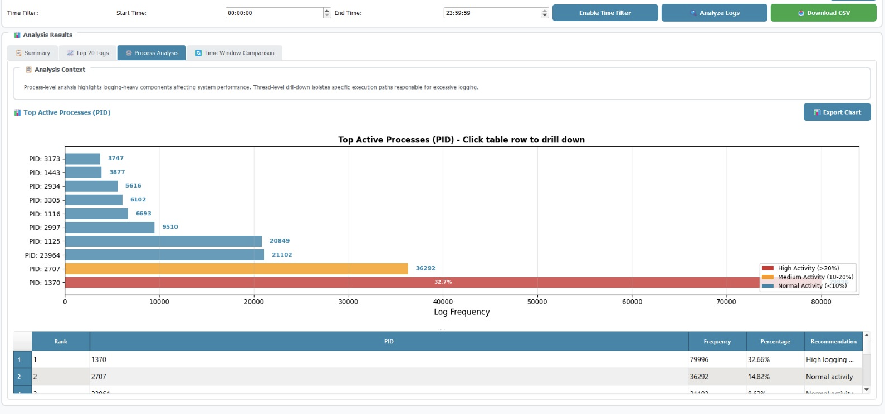
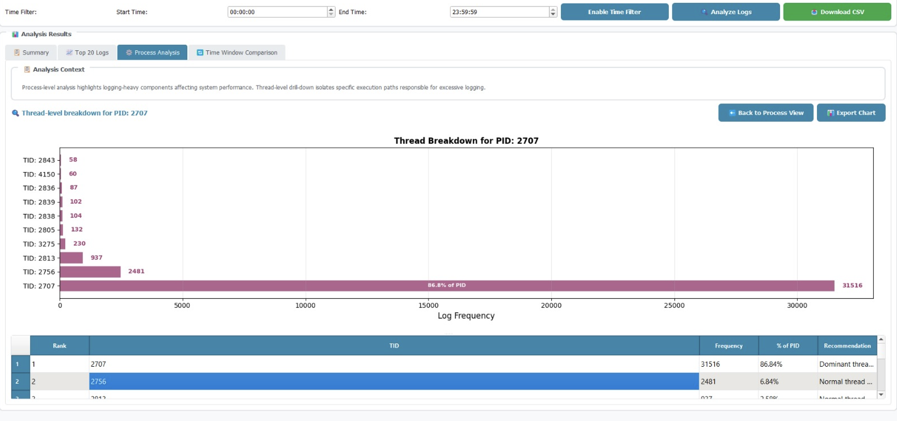
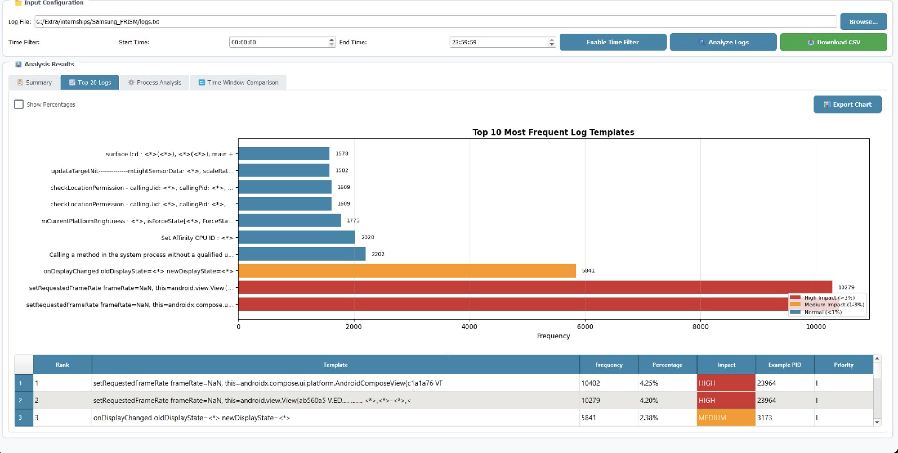

# UI Demonstration – LogSense Dashboard

This section presents the primary visualizations generated by the log analysis system.  
All charts dynamically reflect time-window filtering, template aggregation, and structured JSON output integration.

---

## 1. Process-Level Analysis

This view provides a ranked breakdown of active processes (PID) based on log frequency within the selected time window.

Processes are categorized into:

- High Activity (>20%)
- Medium Activity (10–20%)
- Normal Activity (<10%)

Key capabilities:

- Identifies logging-heavy components
- Highlights potential performance impact
- Enables drill-down into thread-level inspection
- Supports export functionality for reporting

---

## 2. Thread-Level Breakdown

This screen provides thread-level (TID) distribution within a selected process.

It enables detailed inspection of execution paths responsible for excessive logging.

Displayed information includes:

- Log frequency per thread
- Percentage contribution to parent PID
- Ranked thread table
- Recommendation classification

---

## 3. Top Log Templates

This section displays the most frequent normalized log templates extracted through pattern mining.

Each template includes:

- Frequency
- Percentage contribution
- Impact classification
- Example PID association
- Priority level

This enables identification of dominant recurring patterns and supports prioritization for debugging or optimization.

---

## System Context

All visualizations are generated from structured JSON outputs produced by the log mining engine.

The backend performs:

- Timestamp parsing  
- Template normalization  
- Frequency aggregation  
- Time-window filtering  
- Baseline vs current comparison  
- Drift and spike detection logic  

The UI consumes this structured output and renders interactive dashboards with drill-down capability.
